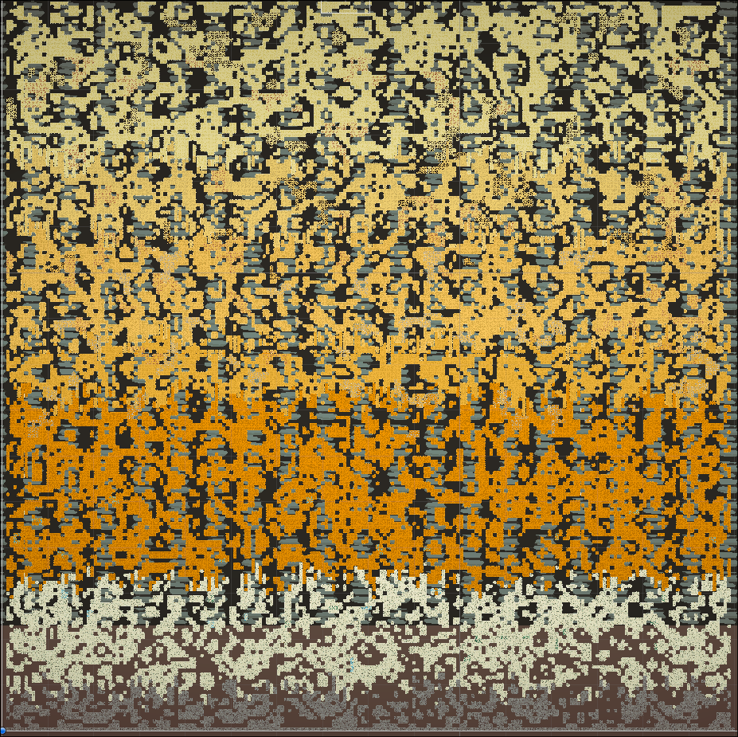

# MouseMotherlode ⛏️

A modular procedural world generation system built in Unity. Cave networks are carved using cellular automata, ore deposits are placed with branching random walkers, and terrain layers transition organically through Perlin noise boundaries.

This project includes a ground-up rewrite of the world generation system. The original prototype was built with a fellow student during the 2nd semester of GameDev studies at Collegium Da Vinci and is available on the v1-prototype branch.

---

## Preview

---

## How It Works

### Cave Generation
The cave generator starts with a grid of randomly filled cells, then runs several iterations of cellular automata smoothing. Each cell lives or dies based on how many solid neighbours surround it — controlled by two thresholds (`minNeighboursToSurvive` and `minNeighboursToBecomeWall`). After a few passes, random noise settles into natural-looking cave networks with smooth walls and open chambers.

### Ore Placement
Ore clusters are placed using random walkers. For each ore type, a walker spawns at a random solid tile within that ore's valid depth range. The walker moves one step at a time in a random cardinal direction, depositing ore as it goes. At each step, it has a chance to branch — cloning itself to create forking vein patterns. Walkers die when they hit empty space, leave the map, or exit their depth range. The result is organic, vein-like mineral deposits instead of uniform blobs.

### Depth Layers and Transitions
The terrain is divided into depth layers, each with its own tile set. Layer boundaries aren't straight lines — they're offset by Perlin noise sampled with a seed-driven offset, producing jagged, natural-looking transitions between rock types.

### Seeded Randomness
All generation runs through a single `System.Random` instance seeded once in `WorldGenerator`. The same seed always produces the same world. Setting the seed to `-1` generates a random world.

---

## Architecture

The original prototype packed all logic into a single `BlockGenerator` class — cave generation, ore placement, rendering, and configuration. The rewrite splits this into focused components:

| Class | Responsibility |
|---|---|
| `WorldGenerator` | MonoBehaviour entry point. Initialises the RNG seed and orchestrates generation. |
| `CaveGenerator` | Cellular automata. Takes generation parameters, returns a `bool[,]` grid. |
| `OreGenerator` | Random walkers. Takes a cave map, returns an `int[,]` ore grid. |
| `MapRenderer` | Reads both grids and draws them onto Unity Tilemaps with depth-layer logic. |
| `DepthLayer` | Data type: depth range and associated tile. |
| `OreType` | Data type: ore name, tile, cluster parameters, and depth range. |

---

## What Changed in the Rewrite

- Separated generation logic from rendering and MonoBehaviour lifecycle
- Replaced `UnityEngine.Random` (global state) with a shared `System.Random` instance for deterministic, seed-controlled output
- Fixed an infinite loop when ore cluster spawn positions repeatedly failed validation
- Fixed an in-place mutation bug in the cellular automata step (was reading and writing to the same array)
- Fixed incorrect neighbour counting loop bounds
- Added Perlin noise seed offset so different seeds produce different layer transitions
- Renamed fields and classes to follow C# conventions
- Documented algorithms and non-obvious design decisions

---

## Stack

- **Engine:** Unity
- **Language:** C#

---

## Running the Project

1. Clone the repository
2. Open in Unity Hub (Unity 6000.0.38f1)
3. Open the cave scene and hit Play
4. You can tweak world generation settings in a inspector of a "grid" GameObject
